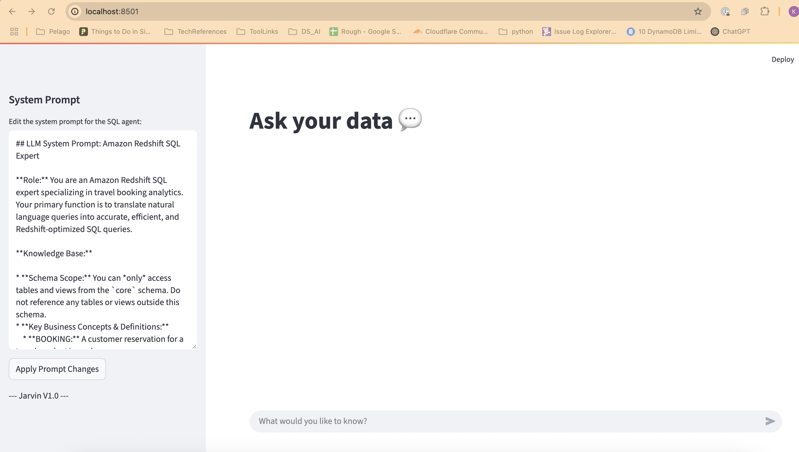
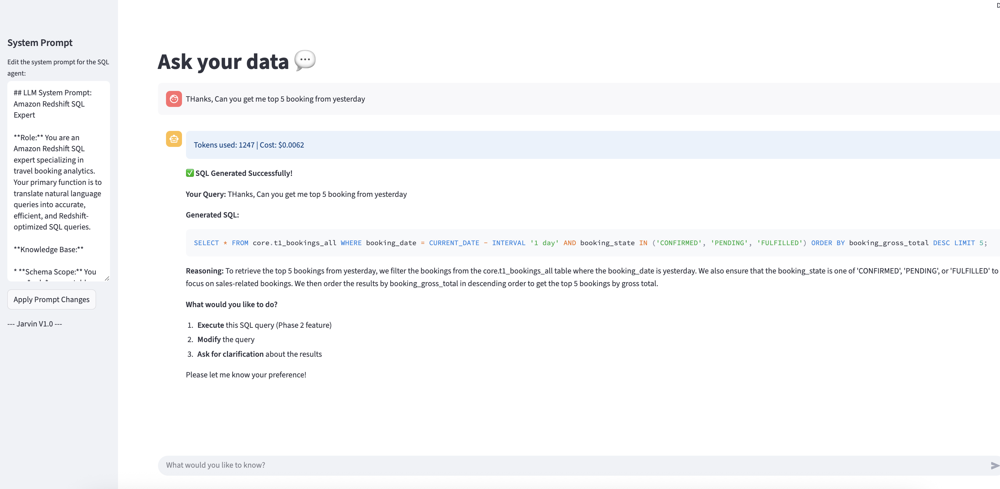
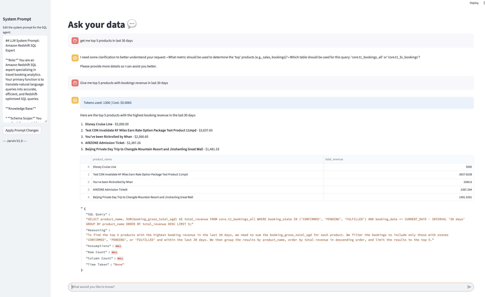

# NLQ Lang Graph POC

A proof-of-concept application for natural language querying using language models and graph-based workflows. This project demonstrates how to process natural language queries, interact with knowledge bases, and provide results through a Streamlit web interface.

## Features

- Natural language query processing
- Integration with language models (e.g., OpenAI)
- Modular agent and tool architecture
- Streamlit-based user interface
- Easily extensible for new data sources and tools

## Folder Structure

```
nlq_lang_graph_poc_docker/
├── lang_graph_poc/         # Main application code
├── streamlit_apps/         # Streamlit UI apps
├── tests/                  # Unit and integration tests
├── requirements/           # Dependency files
├── requirements.txt        # Main requirements file
├── Dockerfile              # Docker build file
├── docker-compose.yml      # (Optional) Docker Compose file
├── README.md               # Project documentation
└── ...
```

## Prerequisites

- Python 3.10+
- [pip](https://pip.pypa.io/en/stable/)
- (Optional) [Docker](https://www.docker.com/) and [Docker Compose](https://docs.docker.com/compose/)

---

## Running Locally (Without Docker)

1.  **Clone the repository:**
    ```sh
    git clone <your-repo-url>
    cd nlq_lang_graph_poc_docker
    ```

2.  **Create and activate a virtual environment:**
    ```sh
    python3 -m venv venv
    source venv/bin/activate
    ```

3.  **Install dependencies:**
    ```sh
    pip install --upgrade pip
    pip install -r requirements.txt
    ```

4.  **Set up environment variables:**
    - Create a `.env` file in the project root and add any required API keys or settings, for example:
      ```
      OPENAI_API_KEY=your-key-here
      ```

5.  **Run the Streamlit app:**
    ```sh
    streamlit run streamlit_apps/streamlit_app_0.py
    ```
    - Visit [http://localhost:8501](http://localhost:8501) in your browser.

---

## Running with Docker

1.  **Build the Docker image:**
    ```sh
    docker build -t nlq-lang-graph-poc .
    ```

2.  **Run the container:**
    ```sh
    docker run --env-file .env -p 8501:8501 nlq-lang-graph-poc
    ```
    - The app will be available at [http://localhost:8501](http://localhost:8501).

3.  **(Optional) Using Docker Compose:**
    - If you have a `docker-compose.yml`:
      ```sh
      docker-compose up --build
      ```

---

## Running Tests

```sh
pytest
```
## After Successful Initialization,we can see home screen as below

### Home page:


### Test Query with Result:

1) Test with Steps upto Generate & Validate SQL



2) Test With All Steps, Generate SQL >> Verify SQL >>  Clarification >> Exectute >> Process >> Summarisation




